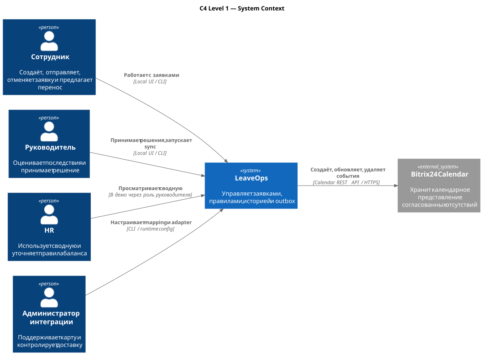
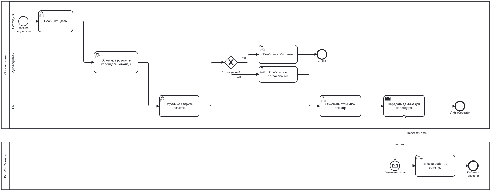
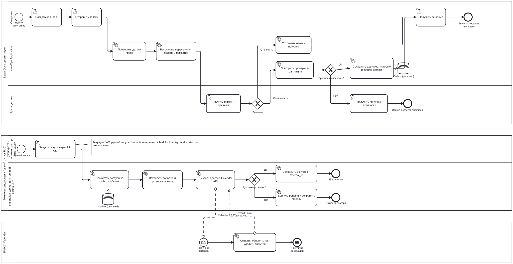
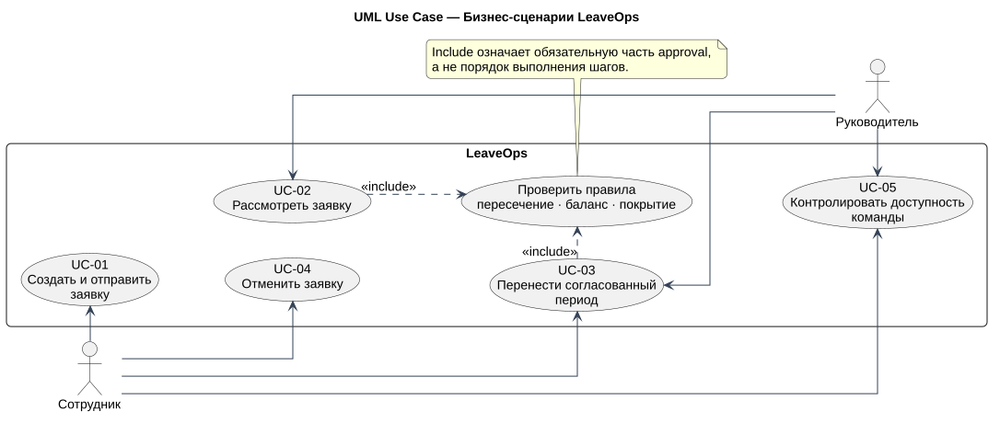
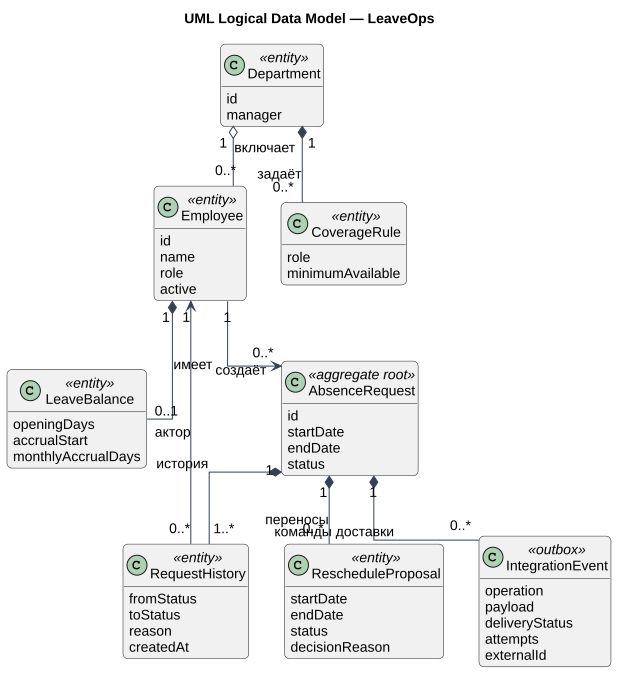
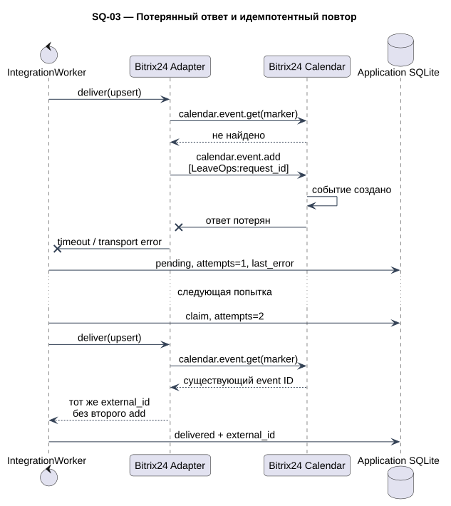
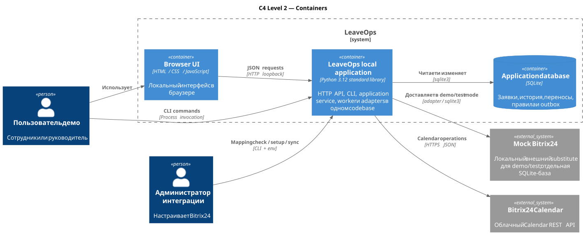

# LeaveOps — кейс системного анализа

## Кратко о проекте

LeaveOps — работающий clean-room PoC процесса управления отсутствиями и односторонней интеграции с Bitrix24 Calendar. Кейс показывает аналитическую цепочку от проблемы и AS-IS до требований, моделей, API-контрактов, реализации и проверок.

**Роль:** системный анализ, моделирование процесса и данных, проектирование интеграционного контракта, реализация демонстрационного прототипа и автоматических проверок.

**Происхождение:** аналитическая модель реконструирована по существующему решению для портфельных целей. Реальные интервью, формальное согласование требований, production deployment и измеренный бизнес-эффект не заявляются.

## Бизнес-проблема

Даты отсутствия, баланс, доступность команды, решение руководителя и календарная запись могут существовать раздельно. Тогда руководитель вручную собирает контекст, согласованный период отдельно переносится в календарь, а основание решения и последующие изменения трудно восстановить в одном месте.

[Problem Statement](docs/discovery/problem-statement.md) фиксирует цели, наблюдаемые критерии успеха, scope и ограничения.

## Discovery

Восстановленный Discovery-слой отвечает на вопросы, которые нужны до детализации решения:

- [заинтересованные стороны, матрица влияния и RACI](docs/discovery/stakeholders.md);
- [план выявления и проверки требований](docs/discovery/elicitation-plan.md);
- [гайд интервью по четырём ролям](docs/discovery/interview-guide.md);
- [факты, допущения, ограничения и открытые production-вопросы](docs/discovery/assumptions-and-open-questions.md).

## Заинтересованные стороны

Сотрудник оформляет и меняет собственный период. Руководитель оценивает последствия и принимает решение. HR использует сводную и определяет кадровые правила. Администратор отвечает за mapping и диагностику доставки. Bitrix24 является внешней системой-получателем.

## AS-IS

Обобщённая модель показывает ручную сверку календаря команды и баланса, отдельную передачу согласованных дат и ручное ведение Bitrix24.

[Разбор AS-IS и исходник BPMN](docs/processes/as-is.md)

## Болевые точки

Шесть `PP-xxx` покрывают реальные проблемы AS-IS: ручную проверку доступности, отдельный баланс, отсутствие единого контекста, несвязанное ведение календаря, перенос без второго решения и фрагментированную историю. Технические угрозы автоматизированной интеграции в этот список не включены.

## Требования

Сохранены стабильные идентификаторы: 5 `BR`, 12 `RULE`, 13 `FR`, 8 `NFR`. Для FR заданы акторы, MoSCoW и acceptance criteria; NFR сформулированы через проверяемое условие.

- [бизнес-требования](docs/requirements/business-requirements.md);
- [бизнес-правила](docs/requirements/business-rules.md);
- [функциональные](docs/requirements/functional-requirements.md) и [нефункциональные требования](docs/requirements/non-functional-requirements.md);
- [19 Given/When/Then критериев](docs/requirements/acceptance-criteria.md);
- [decision tables для approval, reschedule и delivery/retry](docs/requirements/decision-tables.md).

## TO-BE

В TO-BE сотрудник отправляет заявку, LeaveOps рассчитывает preview, руководитель принимает решение, а сервис повторяет правила внутри транзакции. `approved`, история и outbox фиксируются до любой попытки Bitrix24, после чего бизнес-процесс завершается. Worker не запускается сообщением от commit: в текущем PoC руководитель явно запускает синхронизацию в UI либо администратор запускает её через CLI.

[Описание TO-BE и исходник BPMN](docs/processes/to-be.md)

## Use Case

UML-модель разделена на бизнес- и интеграционный контуры, чтобы связи акторов и `<<include>>` оставались читаемыми. Шесть основных Use Case нормализованы по цели, триггеру, условиям, основному, альтернативным и исключительным потокам. В UC-06 первичным актором является человек, который запускает синхронизацию; Bitrix24 — поддерживающий внешний актор, а `IntegrationWorker` — внутренний компонент.

[Обзор и спецификации UC-01…UC-06](docs/use-cases/overview.md)

## Бизнес-правила

Согласование повторно проверяет пересечение, прогноз баланса и минимальное покрытие роли. Выходные входят в длительность и пересечения, но не требуют покрытия. `draft`/`submitted` не резервируют ресурс. Отклонение требует причины, а руководитель не может согласовать собственную заявку.

Крайние комбинации формализованы в [`DT-01` и `DT-02`](docs/requirements/decision-tables.md).

## Модель данных и состояний

Логическая модель содержит Department, Employee, CoverageRule, LeaveBalance, AbsenceRequest, RequestHistory, RescheduleProposal и IntegrationEvent. Физическая модель отдельно фиксирует фактический DDL, CHECK, FK и индексы, включая отсутствие физического FK для `employees.department_id`.

- [логическая модель](docs/data/logical-model.md);
- [физическая модель SQLite](docs/data/physical-model.md);
- [две UML State Machine](docs/data/state-models.md).

## Интеграционное решение

Transactional outbox отделяет решение от доставки. Worker захватывает событие с token/lease. REST-адаптер перед `calendar.event.add` ищет `[LeaveOps:<request_id>]`; поэтому повтор после созданного объекта и потерянного ответа получает существующий ID.

- [четыре UML Sequence Diagram](docs/integration-scenarios.md);
- [граница и поведение outbox](docs/architecture/integration.md);
- [реестр интеграционных рисков и мер](docs/architecture/integration-risks.md);
- [внутренний HTTP API](docs/api/internal-api.md);
- [контракт Bitrix24](docs/api/bitrix24-contract.md).

## Архитектура

Browser UI и CLI обращаются к одному Python codebase. HTTP transport, application service, worker и adapters являются логическими ответственностями, а не вымышленными микросервисами. Внутри границы LeaveOps находятся приложение и его SQLite; Mock Bitrix24 показан снаружи как локальный substitute внешней системы для demo/test.

[C4 и UML Component](docs/architecture/overview.md)

## Ключевые решения

Девять реконструированных ADR объясняют разделение статусов, transactional outbox, повторную проверку, отдельный перенос, marker-based idempotency, личные разделы, SQLite, отсутствие runtime-зависимостей и демонстрационную формулу баланса. Каждый ADR содержит альтернативы, последствия и доказательство в реализации.

[Архитектурные решения](docs/architecture/decisions.md)

## Трассировка

Матрицы разделяют два пути:

`stakeholder → pain point → BR → rule / FR → UC`

и техническую ветку:

`integration risk → NFR → ADR → sequence diagram → component → test`.

[Трассировка v2](docs/traceability.md)

## Проверка

GitHub Actions запускает на push и pull request 52 Python-теста, репозиторный валидатор документации/BPMN, JavaScript syntax check и PlantUML syntax check. Локально отдельно выполнены demo-сценарии, рендеринг и визуальная проверка диаграмм. Живые Bitrix24 smoke-тесты не входят в CI и остаются ручными, поскольку требуют webhook тестового портала.

[Фактический отчёт](docs/verification.md)

## Результат

Работающая цепочка имеет явные доказательства на каждом уровне:

`заявка → серверные правила → решение → history + outbox → worker → Bitrix24`.

Ключевое свойство кейса: внешняя недоступность не делает бизнес-решение недействительным, а повтор не создаёт второй календарный объект.

## Ограничения

- данные и роли синтетические;
- баланс не является юридическим кадровым расчётом;
- нет production IAM, server, scheduler, monitoring и двусторонней синхронизации;
- нет reconciliation, поэтому ручное изменение события в Bitrix24 может создать незаметный drift;
- полный mapping всех шести синтетических сотрудников и уведомления Bitrix24 не проверены;
- коммерческий эффект и production KPI не измерялись.

## Что потребуется для production

Нужно закрыть [открытые вопросы](docs/discovery/assumptions-and-open-questions.md): корпоративную IAM, заместителей согласующего, производственный календарь и источник баланса, retry/backoff/dead-letter policy, алерты, reconciliation с ручными изменениями Bitrix24, retention и эксплуатационные метрики. Эти пункты не включены в реализованный PoC.

Технический запуск и demo flow находятся в [README](README.md) и [руководстве](docs/demo-guide.md).
