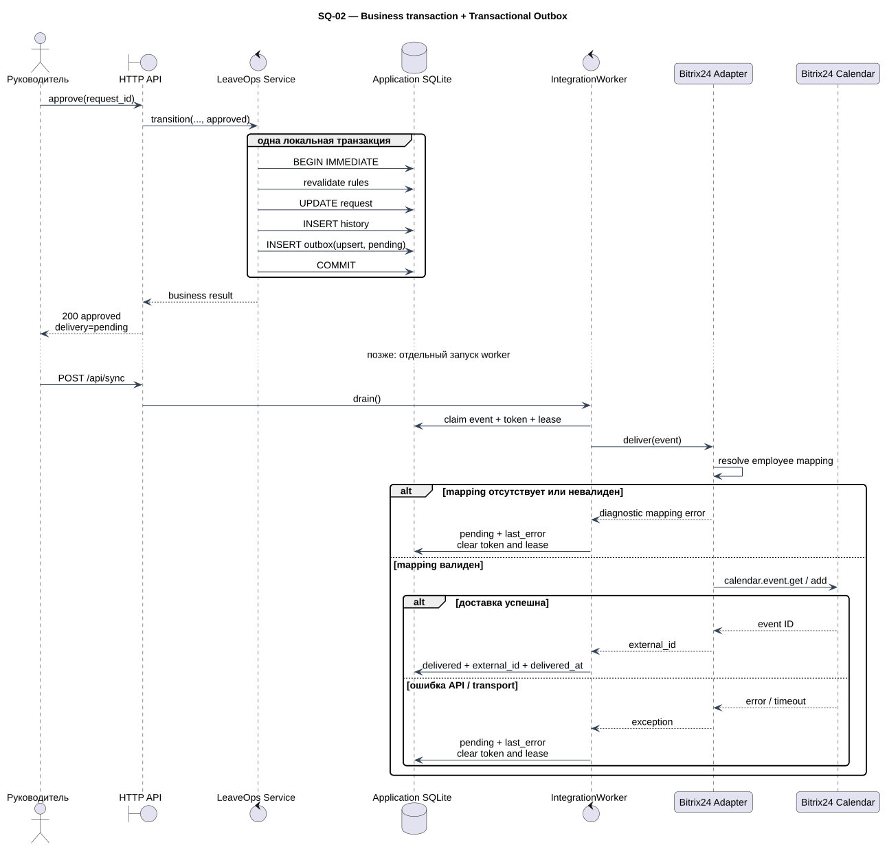

# Интеграционная архитектура

## Граница систем

LeaveOps хранит заявку, решение, историю, баланс и правила. Bitrix24 получает только календарное событие. Недоступность Bitrix24 меняет `integration_events.status`, но не `requests.status`.

## Transactional outbox

При согласовании `LeaveOps.transition` внутри одного `BEGIN IMMEDIATE`:

1. повторяет overlap, balance и coverage;
2. обновляет `requests.status`;
3. добавляет `history`;
4. добавляет `integration_events(upsert)`;
5. выполняет commit.

HTTP/CLI получает бизнес-результат после commit. Вызова Bitrix24 в этой транзакции нет. При отдельном ручном запуске worker захватывает запись по `worker_token` и lease.

## Доставка

| Операция | Адаптер | Результат |
| --- | --- | --- |
| `upsert` | Ищет метку; при отсутствии вызывает `calendar.event.add` | Новый или найденный `external_id` |
| `update` | Требует ID ранее доставленного события; вызывает `calendar.event.update` | Тот же `external_id` |
| `cancel` | Ищет метку и удаляет найденное событие | ID или `absent:<request_id>` |

При исключении worker возвращает событие в `pending`, очищает claim и сохраняет до 1000 символов `last_error`. Успех сохраняет `delivered_at`. Просроченный `processing` доступен следующему worker.

## Идемпотентность

Реальный адаптер помещает `[LeaveOps:<request_id>]` в `description`. Перед созданием он читает события того же личного раздела и периода и ищет метку. Это закрывает сценарий, когда внешний объект создан, а ответ потерян.

Mock использует UNIQUE receipts по `event_id` и отсутствие по `request_id`, обеспечивая тот же наблюдаемый контракт без сети.

## Карта пользователей

Runtime JSON сопоставляет синтетический `employee_id` с уникальным `owner_id` и личным `section_id`. `b24-mapping-check` выполняется без сетевых записей. `b24-setup` находит или создаёт разделы и сохраняет ID атомарной заменой файла.

## Операционная граница

В текущем демо worker запускается вручную через `/api/sync`, `sync` или `b24-sync`; автоматический scheduler, backoff, dead-letter policy и алерты остаются production-вопросами. Эта граница не меняет асинхронность относительно бизнес-транзакции: решение уже зафиксировано до любой попытки доставки.

Недоступность API, потерянный ответ, конкурентный claim, mapping и внешний drift разобраны отдельно в [реестре интеграционных рисков](integration-risks.md).
