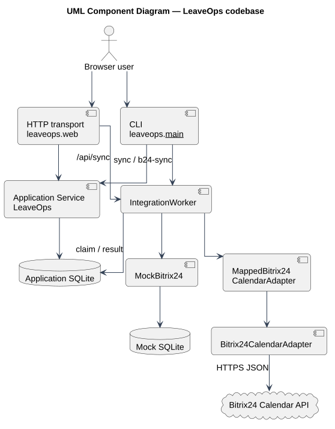

# Архитектура LeaveOps

## C4 Level 1 — System Context

[Исходник PlantUML](../diagrams/src/c4-context.puml)

LeaveOps получает команды сотрудника и руководителя, рассчитывает контекст решения и передаёт только согласованное календарное представление в Bitrix24. HR использует сводную в границах роли руководителя демо. Администратор настраивает исходящую интеграцию.

## C4 Level 2 — Containers

[Исходник PlantUML](../diagrams/src/c4-containers.puml)

### Внутри границы LeaveOps

| Container | Технология | Ответственность |
| --- | --- | --- |
| Browser UI | HTML/CSS/JavaScript | Локальный интерфейс, выбор демо-актора, вызов HTTP API |
| LeaveOps local application | Python 3.12 stdlib | HTTP API, CLI, бизнес-правила, транзакции, worker и адаптеры |
| Application database | SQLite | Сотрудники, правила, заявки, история, переносы и outbox |

### Внешние системы

| System | Технология | Ответственность |
| --- | --- | --- |
| Mock Bitrix24 | Отдельная SQLite-база, только demo/test | Локальная замена внешней календарной системы с объектами и receipts |
| Bitrix24 Calendar | Облачный REST API | Личные разделы и события отсутствия |

HTTP API, application service, worker и адаптер являются логическими ответственностями одного Python codebase. В веб-режиме HTTP server создаёт service и worker в одном локальном процессе; CLI запускает те же модули отдельным процессом. Диаграмма не изображает их отдельными deployable-сервисами. Mock Bitrix24 работает локально, но находится за границей LeaveOps как substitute внешней системы; это тестовая замена, а не production-компонент.

## Логические компоненты

[Исходник PlantUML](../diagrams/src/components.puml)

- `leaveops/web.py` — loopback transport, заголовки, маршрутизация и HTTP errors;
- `leaveops/__main__.py` — CLI и команды настройки интеграции;
- `leaveops/service.py` — бизнес-переходы, доступ, расчёты и SQLite-транзакции;
- `IntegrationWorker` — claim/lease и смена технического статуса;
- `Bitrix24CalendarAdapter` / `MappedBitrix24CalendarAdapter` — внешний контракт и маршрутизация;
- `MockBitrix24` — тестовый адаптер к отдельной локальной замене внешней системы; её SQLite-состояние не входит в границу LeaveOps.

## Технологические границы

Прототип использует Python standard library и не требует runtime-зависимостей. HTTP server слушает только `127.0.0.1`. SQLite сериализует изменяющие операции через `BEGIN IMMEDIATE`. Это сознательный локальный PoC, а не целевая production topology.
