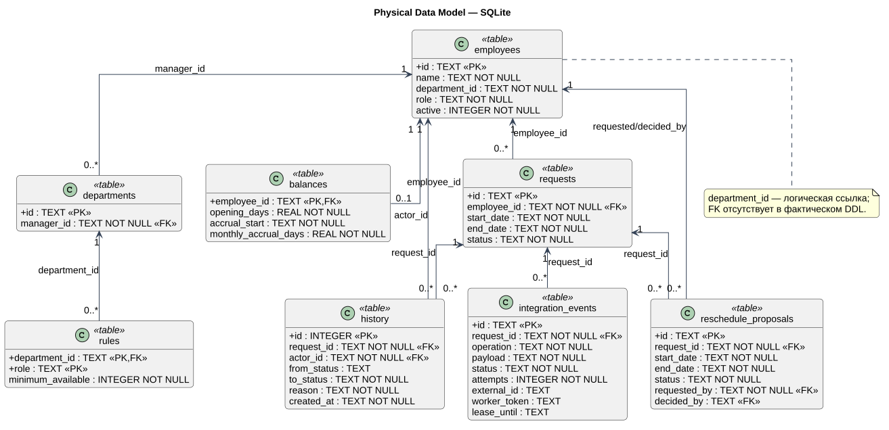

# Физическая модель SQLite

Источник истины — DDL в `LeaveOps.__init__` (`leaveops/service.py`). Таблица ниже отражает фактическую схему приложения, а не концептуальные названия из ранней документации.

[Исходник PlantUML](../diagrams/src/physical-model.puml)

## Таблицы

| Таблица | Колонки и ограничения | PK | FK |
| --- | --- | --- | --- |
| `employees` | `id TEXT`; `name TEXT NOT NULL`; `department_id TEXT NOT NULL`; `role TEXT NOT NULL`; `active INTEGER NOT NULL` | `id` | В DDL нет FK для `department_id` |
| `balances` | `employee_id TEXT`; `opening_days REAL NOT NULL CHECK >= 0`; `accrual_start TEXT NOT NULL`; `monthly_accrual_days REAL NOT NULL CHECK >= 0` | `employee_id` | `employee_id → employees.id` |
| `departments` | `id TEXT`; `manager_id TEXT NOT NULL` | `id` | `manager_id → employees.id` |
| `rules` | `department_id TEXT`; `role TEXT`; `minimum_available INTEGER NOT NULL CHECK >= 0` | `(department_id, role)` | `department_id → departments.id` |
| `requests` | `id TEXT`; `employee_id TEXT NOT NULL`; `start_date TEXT NOT NULL`; `end_date TEXT NOT NULL`; `status TEXT NOT NULL CHECK IN (draft, submitted, approved, rejected, cancelled)`; `CHECK start_date <= end_date` | `id` | `employee_id → employees.id` |
| `history` | `id INTEGER`; `request_id TEXT NOT NULL`; `actor_id TEXT NOT NULL`; `from_status TEXT`; `to_status TEXT NOT NULL`; `reason TEXT NOT NULL`; `created_at TEXT NOT NULL DEFAULT UTC timestamp` | `id` | `request_id → requests.id`; `actor_id → employees.id` |
| `integration_events` | `id TEXT`; `request_id TEXT NOT NULL`; `operation TEXT NOT NULL CHECK IN (upsert, update, cancel)`; `payload TEXT NOT NULL`; `status TEXT NOT NULL DEFAULT pending CHECK IN (pending, processing, delivered)`; `attempts INTEGER NOT NULL DEFAULT 0`; nullable `external_id`, `last_error`, `worker_token`, `lease_until`, `delivered_at`; `created_at` UTC default | `id` | `request_id → requests.id` |
| `reschedule_proposals` | `id TEXT`; `request_id TEXT NOT NULL`; `start_date/end_date TEXT NOT NULL`; `status TEXT NOT NULL CHECK IN (submitted, approved, rejected)`; `requested_by TEXT NOT NULL`; `reason TEXT NOT NULL`; `created_at` UTC default; nullable `decided_at`, `decided_by`; `decision_reason TEXT NOT NULL DEFAULT ''`; `CHECK start_date <= end_date` | `id` | `request_id → requests.id`; `requested_by/decided_by → employees.id` |

## Индексы

| Индекс | Колонки | Назначение |
| --- | --- | --- |
| `integration_events_delivery` | `(status, created_at)` | Выбор старейшего pending или просроченного processing события |
| `reschedule_proposals_request` | `(request_id, created_at)` | Получение предложений заявки в хронологическом порядке |

SQLite foreign keys включаются для каждого соединения через `PRAGMA foreign_keys = ON`. Даты хранятся как ISO `YYYY-MM-DD`, поэтому лексикографическое сравнение соответствует календарному порядку после серверной валидации.

## Ограничения, обеспечиваемые сервисом

- `employees.department_id` логически ссылается на `departments.id`, но физического FK нет из-за порядка начальной загрузки.
- Не больше одного `reschedule_proposal(submitted)` проверяет сервис; частичного UNIQUE-индекса нет.
- Допустимые переходы заявки проверяются в `LeaveOps.transition`, а не только CHECK статуса.
- Payload является JSON-текстом; SQLite JSON schema constraint не задан.

Это честно фиксирует границу текущего PoC и точки усиления production-схемы.
