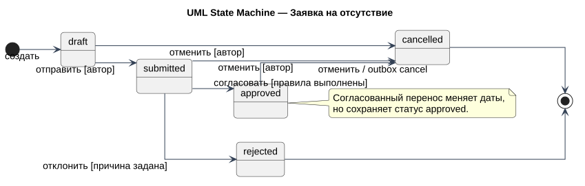
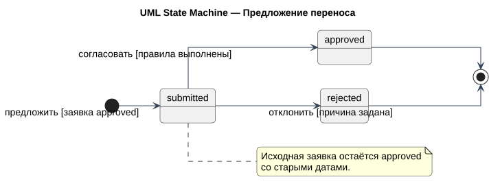

# Модели состояний

## Заявка на отсутствие

[Исходник PlantUML](../diagrams/src/request-state.puml)

Фактические состояния: `draft`, `submitted`, `approved`, `rejected`, `cancelled`.

| Исходное | Событие / актор | Целевое | Условие |
| --- | --- | --- | --- |
| — | Создать / сотрудник | `draft` | Валидные даты, активный актор |
| `draft` | Отправить / автор | `submitted` | Владелец заявки |
| `submitted` | Согласовать / руководитель | `approved` | Свой отдел, не автор; проверки пройдены |
| `submitted` | Отклонить / руководитель | `rejected` | Непустая причина |
| `draft`, `submitted`, `approved` | Отменить / автор | `cancelled` | Владелец заявки |

`rejected` и `cancelled` терминальны. `approved` может быть отменён; согласованный перенос меняет даты, сохраняя статус `approved`.

## Предложение переноса

[Исходник PlantUML](../diagrams/src/reschedule-state.puml)

Фактические состояния: `submitted`, `approved`, `rejected`.

Открытое предложение переноса не изменяет согласованный период заявки. Новые даты становятся действующими только при переходе proposal в `approved`; при `rejected` или конфликте исходные даты сохраняются.
