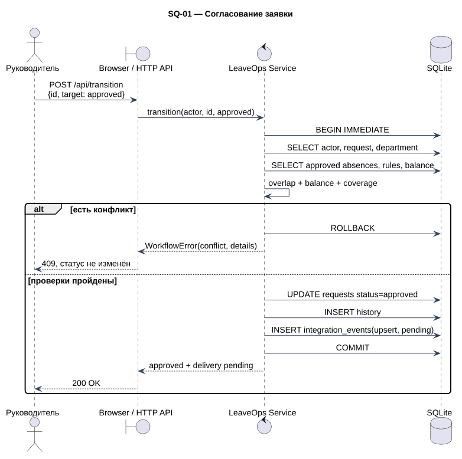
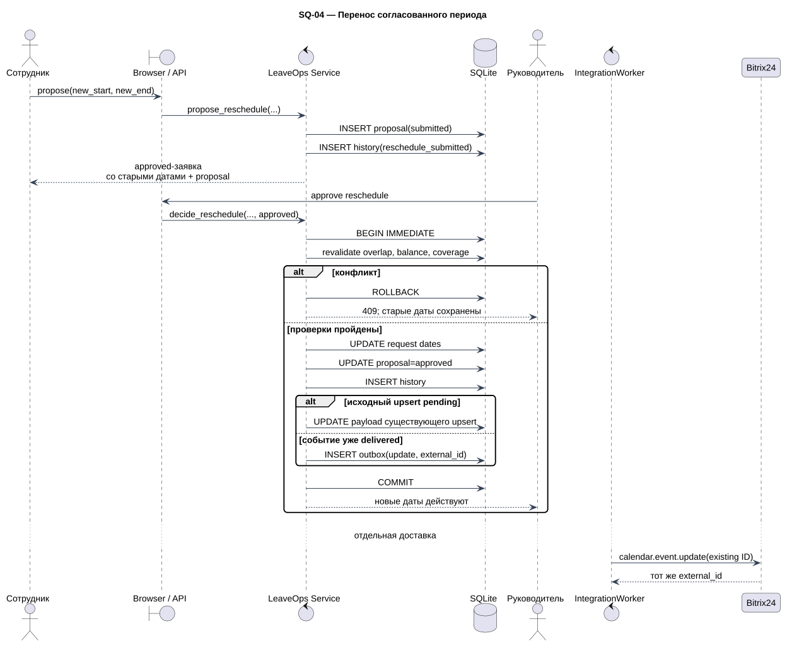

# Интеграционные последовательности

PlantUML-модели отделяют бизнес-решение, локальную транзакцию и внешний вызов.

## SQ-01 — согласование заявки

[Исходник](diagrams/src/sq-01-request-approval.puml)

Показаны авторизация, повторная проверка и rollback при конфликте. В положительной ветви статус, история и outbox фиксируются одной транзакцией.

## SQ-02 — transactional outbox

[Исходник](diagrams/src/sq-02-transactional-outbox.puml)

Ответ `approved / delivery=pending` возвращается после локального commit. Worker и Bitrix24 участвуют позже, при отдельном запуске `/api/sync` или CLI.

## SQ-03 — потерянный ответ

[Исходник](diagrams/src/sq-03-lost-response.puml)

Bitrix24 успевает создать объект, но ответ теряется. Повтор сначала ищет `[LeaveOps:<request_id>]`, получает существующий ID и не выполняет второй `add`.

## SQ-04 — перенос согласованного периода

[Исходник](diagrams/src/sq-04-reschedule.puml)

До решения старый период остаётся действующим. После повторной проверки pending `upsert` получает новые даты либо создаётся `update` для уже доставленного объекта.

## Реакция на ошибки

| Ситуация | Технический результат | Бизнес-статус |
| --- | --- | --- |
| Недоступен Bitrix24 | `pending`, attempts+1, `last_error` | Не меняется |
| Потерян ответ после add | Повтор ищет метку и сохраняет найденный ID | Не меняется |
| Worker завершился после claim | Просроченный lease разрешает новый claim | Не меняется |
| Два worker стартуют одновременно | Один `worker_token` владеет событием | Не меняется |
| Нет mapping или section | `pending` с диагностикой | Не меняется |
| Cancel-цель отсутствует | Идемпотентный `delivered` | Уже `cancelled` |

Контракт полей и методов приведён в [Bitrix24 API contract](api/bitrix24-contract.md), правила выбора исхода — в [`DT-03`](requirements/decision-tables.md).
