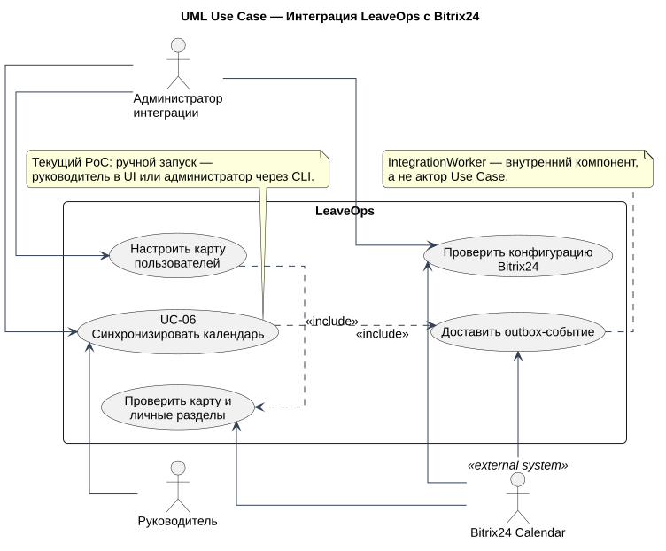

# Обзор Use Case

[Исходник PlantUML](../diagrams/src/use-cases.puml)

[Исходник интеграционной модели](../diagrams/src/use-cases-integration.puml)

| ID | Вариант использования | Основной актор | Цель |
| --- | --- | --- | --- |
| `UC-01` | Создать и отправить заявку | Сотрудник | Передать руководителю корректный период |
| `UC-02` | Рассмотреть заявку | Руководитель | Принять объяснимое решение с повторной проверкой |
| `UC-03` | Перенести согласованный период | Сотрудник, руководитель | Изменить даты только после нового решения |
| `UC-04` | Отменить заявку | Сотрудник | Завершить заявку и убрать согласованный период из календарной проекции |
| `UC-05` | Контролировать доступность команды | Сотрудник, руководитель | Видеть периоды, покрытие и разрешённые данные баланса |
| `UC-06` | Синхронизировать календарь | Руководитель / администратор интеграции | Доставить outbox без изменения бизнес-статуса |

Bitrix24 показан как внешний поддерживающий актор. `IntegrationWorker` является внутренним компонентом реализации UC-06 и не моделируется UML-актором. Внутренние проверки представлены через `<<include>>` только там, где они являются обязательной частью сценария, а не для иллюстрации порядка шагов.
